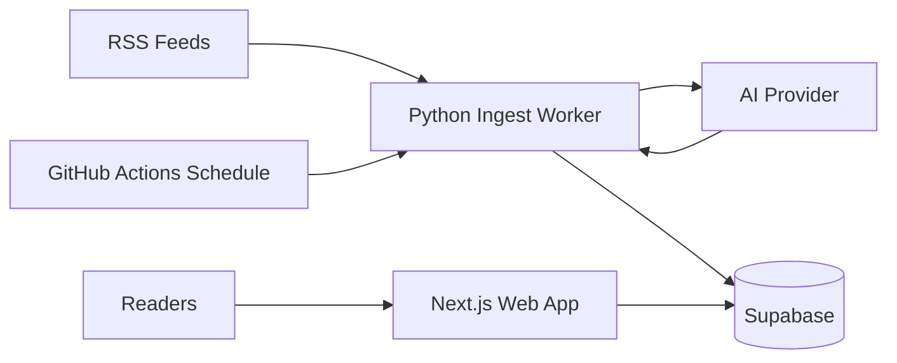

# AI Blogpost Architecture

AI Blogpost is a small polyglot system: a Next.js web app, a Python ingestion worker, and Supabase as the shared persistence layer.

It is not a classic monolith because the read path and write path run as separate runtimes. It is also not a formal package-managed monorepo yet. The repo is structured as a lightweight monorepo-style project with explicit app, service, infrastructure, and documentation boundaries.

## Runtime Boundaries

## Components

- `apps/web`: Next.js app that renders the public site, blog detail pages, tag filtering, and markdown content.
- `services/ingest`: Python worker that fetches RSS feeds, deduplicates candidates, scrapes article context, generates AI posts, validates output, and writes to Supabase.
- `infra/supabase`: Database contract documentation and migration location.
- `.github/workflows`: Scheduled automation for ingestion and RSS health checks.

## Data Flow

1. GitHub Actions starts the ingest worker on a schedule or manual dispatch.
2. The worker fetches RSS feeds and filters for technology-related items.
3. Candidate stories are deduplicated and enriched with scraped article content when available.
4. The AI generator returns structured post data.
5. The worker validates and stores the post, tags, sources, and audit metadata in Supabase.
6. The Next.js app reads published posts from Supabase and renders them for readers.

## Architectural Decision

Keep the web app and ingest worker separate. The worker has long-running, network-heavy responsibilities that fit a scheduled batch process better than a request/response web server.

Supabase is the correct integration point at this scale. If the product grows, the next major architecture step should be queue-backed ingestion, not merging the worker into the web app.
